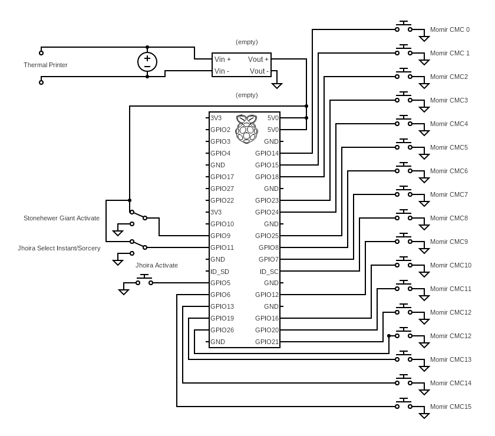

# Momir Basic Contraption

## Concept
Momir Basic is a game mode for the Trading Card Game _Magic, The Gathering_. It is usually played in Magic Online, an quite unplayable in Paper, because one of the main components is a random card generator. This device brings this random card generator into our three dimensional meat space.


## Hardware
### Bill of Materials
- 17 Buttons
- 2 single pole, double throw switches
- 1 adjustable Voltage Converter capable of converting the 9V 5A inpit to 5V
- said 9V 5A DC Power Supply
- 1 barrel jack that fits the power supply
- 1 Raspberry Pi 4 with SD Card
- 1 Thermal Printer (i used the adafruit tiny thermal printer)
- Perf board
- jumper cables
- pins and a 2x20 socket
- solder supplies
- USB-A to MiniB cable (mine came with the printer
)
- case that fits all the components

### Schematics



## Software
the Raspberry Pi uses the newest raspbian at time of printing. I have edited the crontab so the ```main.py``` script runs on ```@reboot``` without any user input.

To install the printer driver i followed [these Instructions](https://cdn-learn.adafruit.com/downloads/pdf/networked-thermal-printer-using-cups-and-raspberry-pi.pdf) sans the networked printer stuff.

The used python modules can all be found in the ```requirements.txt```

if those are all installed, the python code should run

### Update
To ensure the fastest responsetime in game, the card database is downloaded ahead of time. Run the ```update.py``` script, and card images and the corresponding qr codes are downloaded to the file system. so you can momir on the go if you so please.

### Holiday Spirit
for an Event in my local game store i was asked to modify the code a bit, and print not only random creatures but all spells. this mode can be activated or deactivated with the ```ChristmasSpirit``` flag in both the update and the main script.

the 0 Button is used to print the QR-Code of the card, and the 15 button is used to print one at complete random